# Connection Service

Сервис управления видеопотоками с адаптивным контролем качества в зависимости от состояния сетевого соединения.

## Обзор проекта

**Connection Service** - это система, предназначенная для управления множественными источниками видео и их ретрансляции с учётом качества сетевого соединения. Система поддерживает интеллектуальное переключение между источниками и динамическую настройку параметров стрима в зависимости от пропускной способности сети.

## Ключевые возможности

- Одновременная работа с несколькими источниками видео (RTSP камеры, OAK-D камеры)
- Адаптивное управление качеством потока на основе мониторинга сети
- Автоматическое переключение между источниками при деградации сигнала
- Настраиваемые профили качества для различных условий сети
- Ретрансляция через RTP протокол

## Основные компоненты системы

- **Restreamer**: Центральный класс, управляющий всеми компонентами
- **FFMPEGInput/DAICameraInput**: Источники видео, получающие кадры с камер
- **FrameDistributor**: Ключевой компонент для распределения кадров между потребителями
- **FFmpegRTPStreamer**: Обработчик выходящего потока через RTPS протокол
- **SignalPolicyEngine**: Регулирует качество потока в зависимости от сигнала
- **KeeneticRCIClient**: Опрашивает роутер для определения качества соединения

## Архитектура системы

Система построена на модульной архитектуре с четким разделением ответственности между компонентами:

### Архитектура всего проекта

#### Ключевые компоненты
- `Restreamer` - центральный класс, управляющий всеми компонентами системы
- `InputSources` - модули для работы с различными источниками видео
- `FrameDistributor` - распределяет видеокадры между различными потребителями
- `SignalPolicyEngine` - управляет качеством видеопотока на основе состояния сети
- `RTPStreamers` - передают обработанное видео на целевые устройства

## Диаграмма работы с FFMPEG и FrameDistributor

### FrameDistributor

Ключевой компонент системы - **FrameDistributor**, который обеспечивает потокобезопасное распределение кадров между всеми зарегистрированными потребителями. 

Его основные функции:

- `add_consumer(consumer_fn)` - регистрация нового обработчика кадров
- `remove_consumer(consumer_fn)` - удаление обработчика
- `distribute(frame_bytes)` - отправка кадра всем зарегистрированным обработчикам

FrameDistributor выступает центральным звеном между источниками и потребителями видео, обеспечивая потокобезопасное распределение кадров между всеми зарегистрированными обработчиками.

## Режимы работы

Система поддерживает два основных режима работы:

**Адаптивный режим** - с динамическим контролем качества на основе состояния сети:

- Автоматически снижает битрейт и разрешение при ухудшении качества соединения
- Приоритизирует работу с DAI камерой при критически низком качестве сигнала
- Восстанавливает высокое качество при улучшении сигнала

**Стандартный режим** - с фиксированными параметрами качества для всех источников.

## Конфигурация
Параметры системы настраиваются через файл main.conf. Основные параметры включают:

- URL и учетные данные для подключения к камерам
- Настройки по умолчанию для видеопотоков (разрешение, битрейт, FPS)
- Параметры для подключения к роутеру (для адаптивного режима)
- Пороговые значения для работы политик качества
 
## [Более детальное описание проекта](ProjectStruct.md)